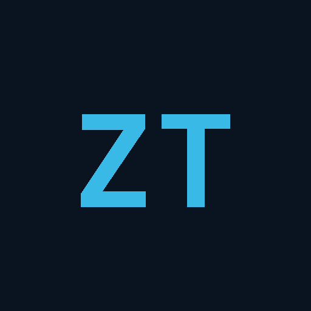

<p align="center">
  
</p>

<h1 align="center">ZeroTick</h1>

<p align="center">
  <strong>Make everyday Windows failures understandable — and, when it is safe, fixable in one click.</strong><br />
  One place for network, audio, removable storage, Bluetooth, drivers, blue screens, and ports.
</p>

<p align="center">
  <b>English</b> · <a href="README.zh-CN.md">简体中文</a>
</p>

<p align="center">
  <a href="LICENSE"></a>
  
  
  <a href="https://github.com/ichenh/zerotick/releases/latest"></a>
  <a href="https://github.com/ichenh/zerotick/actions/workflows/ci.yml"></a>
  <a href="https://github.com/ichenh/zerotick/actions/workflows/release.yml"></a>
</p>

<p align="center">
  <a href="#why-zerotick">Why ZeroTick</a> ·
  <a href="#what-it-can-do">Features</a> ·
  <a href="#install">Install</a> ·
  <a href="#quick-start">Quick start</a> ·
  <a href="#build-from-source">Development</a> ·
  <a href="CHANGELOG.md">Changelog</a>
</p>

---

## Why ZeroTick

Windows problems often arrive without a useful explanation: Wi-Fi or Bluetooth disappears, sound suddenly stops, a removable drive is “in use” even though no window is open, an encrypted disk looks broken before it is unlocked, or a blue screen leaves only a code that means little to most people. The relevant controls and evidence are scattered across Settings, Device Manager, Disk Management, Event Viewer, services, registry entries, and command-line tools.

**ZeroTick exists to close that gap.** It brings common Windows devices and recovery tasks into one approachable application. A normal user should be able to see what happened, what the consequence is, and what to do next without learning Windows internals. When a safe automated recovery is available, ZeroTick offers it directly. When it cannot fix the problem, it gives a plain-language path forward instead of stopping at an error code.

Advanced mode keeps the same workflow while exposing device instance IDs, PIDs, service states, raw errors, dump evidence, and scan tuning for experienced users.

## What it can do

| Area | What ZeroTick checks and manages |
|------|----------------------------------|
| **Full health check** | Runs the major diagnostics together, isolates slow system queries with timeouts, and summarizes the issues that need attention |
| **Network** | Active adapters, gateway reachability, DNS, key services, VPN and proxy configuration, the application behind a local proxy, speed test, DNS refresh, and guided repair |
| **Audio** | Output and input devices, default endpoint, volume, mute, shared/exclusive modes, Windows audio services, and common permission failures |
| **Removable storage** | Groups volumes by physical enclosure, distinguishes locked media, empty card-reader slots, and unreadable media, identifies likely locking programs, requests safe closure, ejects one volume or the whole device, and offers guarded quick/full formatting |
| **Bluetooth** | Missing adapters, driver and support-service health, paired peripherals, reconnect, repair, and confirmed device removal with re-pairing guidance |
| **Devices & drivers** | Common Device Manager failures, disabled or missing hardware, readable explanations for error codes, and hardware-change rescanning |
| **Blue screens** | Minidump and BugCheck history, WinDbg evidence when available, likely-cause grouping, and practical follow-up or repair actions |
| **Ports** | Local listeners and connections, owning programs, Windows-reserved ranges, and cautious release of recognized development leftovers |
| **Monitoring & history** | Event-driven USB/Bluetooth disconnect tracking, transient-disconnect detection, tray status, native notifications, local history, and JSON/CSV export |

### Designed for both beginners and experts

- **Normal mode** prioritizes status, impact, safe actions, and readable next steps.
- **Advanced mode** adds raw system evidence without replacing the user-facing explanation.
- Potentially destructive operations are explicit: full format and Bluetooth device removal require confirmation, while USB eject follows Windows' final safety decision.
- Administrator access is requested only for operations that modify protected Windows services, devices, or settings; read-only diagnostics remain useful without it.

## Install

### Download a release

Download the latest package from [GitHub Releases](https://github.com/ichenh/zerotick/releases/latest):

- `ZeroTick_*_x64-setup.exe` — recommended for most users; the installer lets you choose whether to install for the current user or everyone on the PC
- `ZeroTick_*_x64_en-US.msi` — intended for IT-managed deployment; most users do not need this file

> GitHub release installers are currently not code-signed. Most systems can install them normally, but Windows may show **Unknown publisher** or a Microsoft Defender SmartScreen warning depending on local policy and file reputation. Download ZeroTick only from this repository's Releases page. Each release includes `SHA256SUMS.txt`; compare it with `Get-FileHash .\ZeroTick_*.exe -Algorithm SHA256` when you need to verify file integrity. Advanced users can also verify its GitHub build provenance with `gh attestation verify .\ZeroTick_*.exe --repo ichenh/zerotick`.

ZeroTick supports Windows 10/11 x64 and uses Microsoft Edge WebView2. WebView2 is already present on most supported Windows installations; the installer can bootstrap it when needed.

> Some repair operations require administrator privileges. ZeroTick explains why before elevation and does not require permanent administrator mode for ordinary diagnostics.

## Quick start

1. Install and launch ZeroTick. It starts in the Windows notification area.
2. Open the tray icon and choose **Open Dashboard**.
3. Select **Full health check** for a broad review, or open the affected area directly.
4. Read the status and recommended actions. Use **Repair** only when it matches the issue shown.
5. Enable **Advanced mode** in Settings when raw evidence or scan parameters are needed.

ZeroTick exposes all 37 supported interface languages in Settings. English is always available as the offline fallback; the other 36 translations are published as independent, version-matched GitHub Release assets for on-demand installation. On first launch, ZeroTick matches the ordered Windows language preferences and installs the closest available translation automatically. Build-time checks reject incomplete language packs.

## Safety and privacy

- Back up important data before formatting, changing partitions, or acting on a failing drive.
- ZeroTick will not bypass Windows' device-removal veto. If Windows still reports open handles, the app shows the available blocker evidence and next steps.
- A one-click repair is a guided recovery attempt, not a guarantee against failing hardware, damaged data, or vendor-specific driver defects.
- No account is required. Settings, device history, and debug logs stay under `%APPDATA%\com.zerotick.desktop\`.
- Most diagnostics are local. The optional speed test downloads a 1 MiB test payload from Cloudflare; advanced dump analysis may retrieve symbols from Microsoft's public symbol server.

## Local data

| File | Purpose |
|------|---------|
| `settings.json` | Application preferences and scan settings |
| `device_history.json` | Local USB/Bluetooth event history |
| `zerotick_debug.log` | Diagnostic log for troubleshooting |

## Build from source

Development is Windows-native. Follow the [Tauri prerequisites](https://v2.tauri.app/start/prerequisites/) and install:

- Windows 10/11 x64
- Microsoft C++ Build Tools with **Desktop development with C++**
- Microsoft Edge WebView2
- Rust 1.85 or later
- Node.js 22 LTS or later

```powershell
git clone https://github.com/ichenh/zerotick.git
cd zerotick
npm ci
npm run check:release
npm run build
cargo test --manifest-path src-tauri/Cargo.toml
cargo clippy --manifest-path src-tauri/Cargo.toml --all-targets -- -D warnings
npm run tauri build
```

Installers are written to:

```text
src-tauri\target\release\bundle\nsis\
src-tauri\target\release\bundle\msi\
```

For local development:

```powershell
npm run tauri dev
# When testing administrator-only flows:
npm run tauri:dev:admin
```

### Architecture

| Layer | Implementation |
|-------|----------------|
| UI | Vite, Vanilla JavaScript, CSS, one offline fallback plus independently validated language packs |
| Desktop shell | Tauri 2, tray integration, notifications, autostart, native dialogs |
| Diagnostics | Rust orchestration with Win32 APIs, WMI, PowerShell fallbacks, Event Log, and Minidump/WinDbg analysis |
| Monitoring | Event-driven `WM_DEVICECHANGE` message pump plus bounded background checks |
| Safety | Backend parameter validation, protected-process rules, elevation checks, timeouts, and explicit destructive-action confirmation |

The main implementation lives in [`src/`](src/) and [`src-tauri/src/`](src-tauri/src/). See [CONTRIBUTING.md](CONTRIBUTING.md) for pull requests and releases, [CHANGELOG.md](CHANGELOG.md) for version history, and [AGENTS.md](AGENTS.md) for repository automation conventions.

## Contributing and support

- Report reproducible defects or request features in [GitHub Issues](https://github.com/ichenh/zerotick/issues).
- Include the Windows version, ZeroTick version, reproduction steps, and relevant advanced evidence or logs. Remove personal paths or device identifiers before posting publicly.
- Contributions are welcome; please read [CONTRIBUTING.md](CONTRIBUTING.md) before opening a pull request.

## License

[MIT](LICENSE) © ZeroTick Contributors
